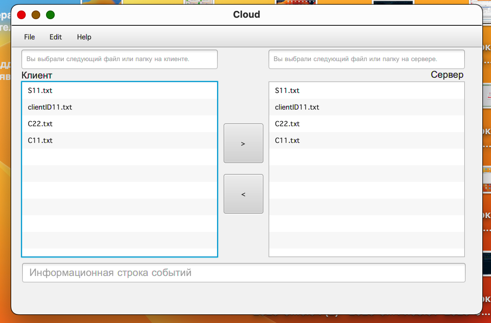

  

<h2> Назначение проекта </h2>

<h3> CLOUD STORAGE - приложение для обмена для различными файлами локальным диском пользователя и облачным хранилищем(Сервером).</h3>
<body>
   <dev>
   
Сервис позволяет:

     <ul>
     <li>Производить регистрацию пользователей;</li>
     <li>Авторизовывать пользователей по логину и паролю;</li>
     <li>Сохранять файлы на локальном диске и отправлять их под учетной записью пользоваьеля на сервер;</li>
     <li>Проводить работу с файлами пользователя на клиентской и серверной стороне (копирование/удаление/переименование);</li>
     </ul>
   </dev>
  <dev>
   
Сервис в своей работе использует:

   <ul>
     <li>Для передачи файла от клиента в облако (на сервер) Java фреймворк Netty.</li>
     <li>Для сохранения данных пользователей (логин\пароль) sqlite database;</li>
     <li>На стороне клиентской и серверной части приложения для работы с файлами используется библиотека java.nio и Stream API;</li>
     <li>Графический интерфейс клиента выполнен на платформе JavaFX ;</li>  
     <li>Для сборки проекта используем Apache Maven;</li>  
     </ul>
  </dev>

  <dev>
   
Иллюстрации работы приложения:

   <ul>
    
Окно входа в приложение

    
Окно регистрации

    
 Основное меню приложения

     </ul>
  </dev>

   

  <dev>
     <h2>Сборка приложения:</h2>

   <dev>
   
Требуется выполнить следующие шаги:

     <ul>
     <li>Сделать git clone этого проекта: <a href="https://github.com/AndreyIgnatev/GB-Cloud-Storage-For-Netty.git">https://github.com/AndreyIgnatev/GB-Cloud-Storage-For-Netty.git</a></li>
     <li>Собрать архив при помощи maven, используя команду в терминале: <code>mvn clean package</code></li>
    </ul>
         </dev>
  </dev>
   

     <dev>
     <h2>Технические требования:</h2>
<ul> 
<li> Java версии не ниже 8; </li> 
</ul>
</dev>
